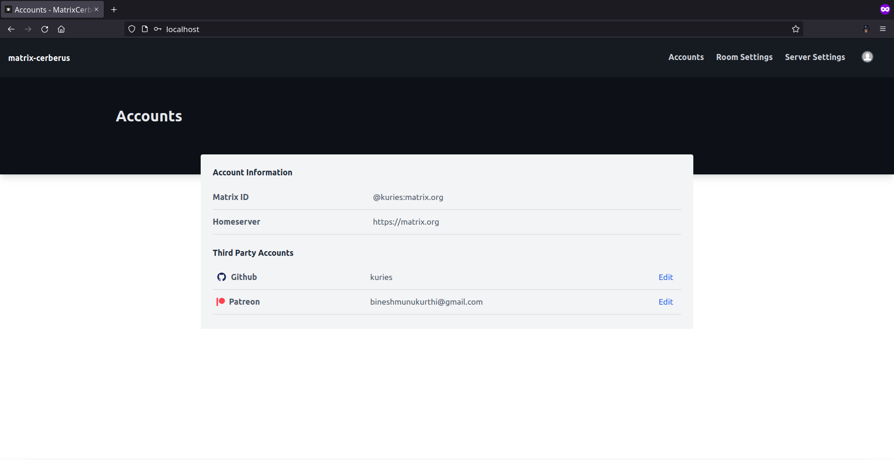

Accounts Page
==============

**Route**: /

This is the first webpage that will be displayed to an **authenticated** user.
**Unauthenticated** users are redirected to the [Login](./login.md) page.

One can view/edit their third party accounts details here.

To link a different **GitHub**/**Patreon** user account to their current matrix username, one can click on the **Edit** button provided and follow the **OAuth** process to give the application access to the third party account.
