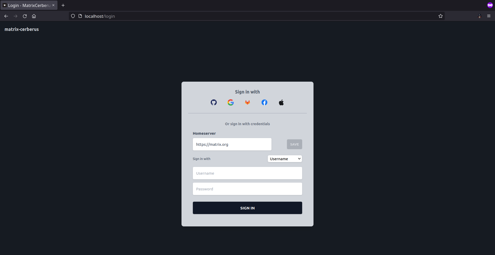

Login Page
==============

**Route**: /login

This is the first webpage that will be displayed to an **unauthenticated** user.

The functionality of this webapge is similar to the login page provided by [Element](https://app.element.io/#/login).

A user can authenticate with the application by logging in to matrix through the following methods:
- [Password based](https://spec.matrix.org/v1.3/client-server-api/#password-based)
- [Single Sign-on](https://spec.matrix.org/v1.3/client-server-api/#single-sign-on)
