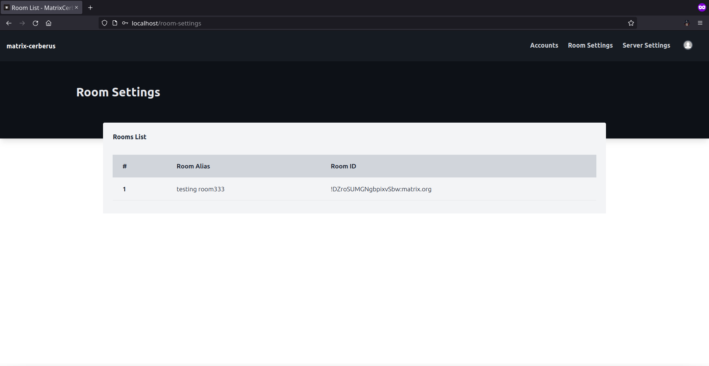

Room Settings Page
==============

**Route**: /room-settings

Webpage which displays the rooms for which the current user has permissions to add third party conditions.

This can be accesible by clicking on the **Room Settings** on the navbar.

Each row in the table will open a specific [Rooms]() webpage by appending **room_id** as a path paramater to the end of **/rooms** route.

A **room_id** will appear among the list of rooms only if it satisfies the following:
- The current user is a member of the room and has minimum power level.
- Bot is a member of the room and has **invite**, **kick** permissions.
