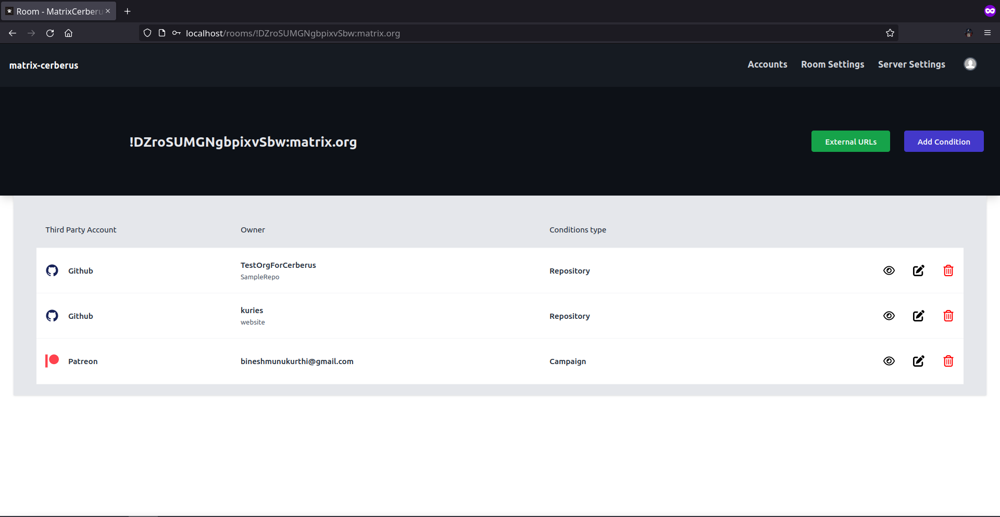
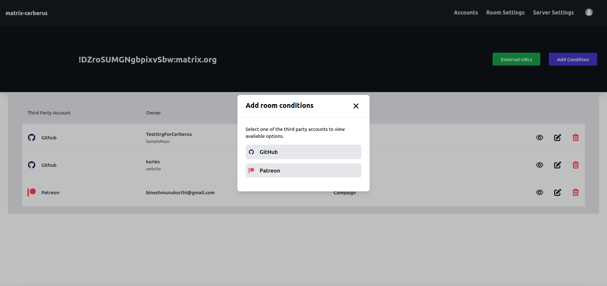
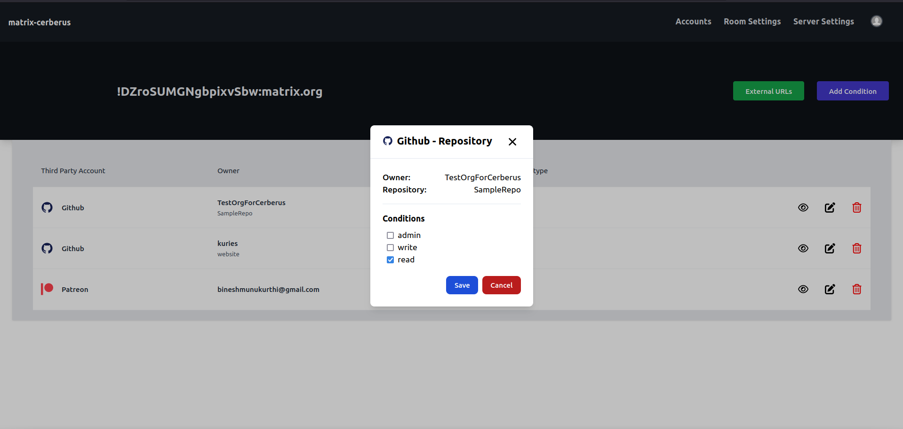

Rooms
==============

**Route**: /rooms/{room_id}

This webpage is specific to the **room_id** for which the current user intends to edit third party conditions.

There are two buttons available right below the **Navbar** (i.e. [External Url](./rooms/room_external_url.md) and [Add Conditions](#add-conditions)) where each directs the user to different webpages.

## Add Conditions

The "Add conditions" button opens a modal which displays all the third party services currently supported by the application.

Each option leads to a webpage listing out the options based on the third party account linked with matrix user ID.

For more details on how to add conditions specific to a third party service, check out the following pages

- [GitHub](./rooms/github_conditions.md)
- [Patreon](./rooms/patreon_conditions.md)

## Edit Conditions

One has the option to preview/edit/delete the existing coniditions for a particular room.

## How do these conditions work?
To keep it brief, all of these conditions work in a **"if any one of these are satisfied then _let them in_ otherwise, don't"** manner.

For example if there are two conditions set for a room,
1) Allow users with read only access to "TestOrgForCerberus/SampleRepo" repository to join the room.
2) Allow patreon users who have contributed atleast **55$** to Bob's campaign join the room.

If a user has **write** permissions for the **SampleRepo** and contributed **60$** to Bob's **campaign** then they satisfy only condition 2. (Since, condition 1 is only asking for read-only users)
In this case, the user will be invited to the room if they are not already part of the room.

### What if they fail to satisfy any of the conditions present?

In this case, the user will either be
- kicked from the room
- invite is withdrawn or
- knock will be rejected

depending on their current state.
