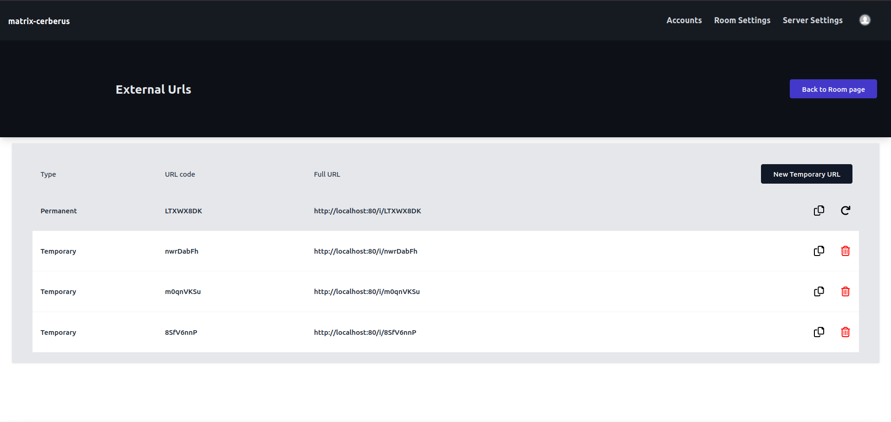

Room External URL
==============

**Route**: /rooms/{room_id}/external-url

All the external URLs for a particular room will be available here.

The URLs are of two types:
- Permanent
- Temporary (single use only)

For permanent URL, you have the option to generate a new URL in place of the existing one.
For temporary URLs, you can either delete or add a new one.
